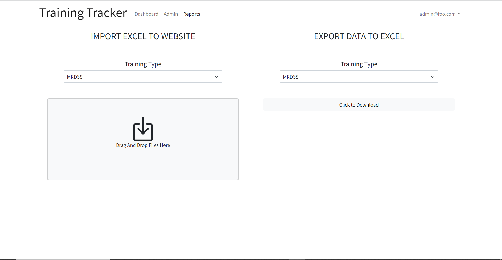

# Training-Tracker

## Table of Contents

* [Sponsors](#sponsors)
* [Team Members](#team-members)
* [ENGR 401 Fall 2022 Work](#engr-401-fall-2022-work)
* [ICS 496 Spring 2023 Work](#ics-496-spring-2023-work)
* [Continuous Integration](#continuous-integration)

## Sponsors
 - MSgt Kyra Santos
 - Gloria Choo

## Team Members

### ENGR 401 Fall 2022 Team
- Elis Diep
- Patima Poochai
- Yhanessa Sales
- Daniel Luong
- Zhixin Li

### ICS 496 Spring 2023 Team
- Elis Diep
- Thane Luna
- Trevor Kansaki

## ENGR 401 Fall 2022 Work

The ENGR 401 Fall 2022 team worked on research, interveiws, and mockups most of which is documented [here](documents/ENGR401_Fall2022_FinalPresentation.pdf). A deployed demo version can be found [here](https://main.d32ai1lyqme0q3.amplifyapp.com/)
### Resources
- [ENGR 401 Final Presentation](documents/ENGR401_Fall2022_FinalPresentation.pdf)
- [Demo](https://main.d32ai1lyqme0q3.amplifyapp.com/)

### Dashboard Mockup

### Profiles page Mockup

### Reports page Mockup

## ICS 496 Spring 2023 Work
The ICS 496 Spring 2023 team worked implementing the mockups in Reactjs done so on Github [here](https://github.com/ICS496-Training-Tracker/ICS496-Training-Tracker).

### Resources
- [Source Code](https://github.com/ICS496-Training-Tracker/ICS496-Training-Tracker)
- [Initial Presentaion](documents/ICS496_Spring2023_InitialPresentation.pdf)
- [Mid-Semester Presentaion](documents/ICS496_Spring2023_MidSemesterPresentation.pdf)
- [Final Presentaion](documents/ICS496_Spring2023_FinalPresentation.pdf)
- [Poster Presentaion](documents/ICS496_Spring2023_Poster.pdf)
- [Overview of Existing Systems](documents/ICS496_Spring2023_Overview.pdf)
- [ArcNet Documents](documents/ICS496_Spring2023_ARCNET.pdf)
- [MRDSS Screenshots](documents/ICS496_Spring2023_MRDSSScreenshots.pdf)

### Logistics
The idea behind this app is not to replace the existing systems, but to integrate with them, allowing all data between all systems to be consolidated into this one app including the viewing and editing of stats on other systems through this one.

There are three types of users: Admin, Unit_Trainer, and Unit_Member. Admins have admin privileges over all users and access to all profiles and accounts. Unit_Trainers will have admin access only to account under the same unit. Unit Members will only be able to view their own profile and stats.

Due to time constraints and lack of access to the existing system databases, Mock databases will be created in Meteor Mongo in order to help visualize data in this prototype.

### Technical Implementation
- ReactJS
- React Bootstrap5
- Meteor
- MongoDB
- NPM

### Landing Page

### Sign-in page

### Dashboard

### Profiles page

Search bar implemented to search every field for the inputed string. Search button may no longer be neccessary. Sort APi implemented by clicking the field column header on the top, and will be sorted by this field in alphabetical order. The header is hilighted or darkened to indicate sorting by this field.

### View/Edit Profiles page

View and edit functions put on the same page to decrease loading time and simplify UI. 

### Reports page

Drag and drop API created ti import .xlsx and .csv files. Temporary function and components used to showcase data parsing functions implemented.

### Next Steps
- Implement feedback from our sponsor MSgt Santos 
- Update and fix bugs 
- Continue to integrate functionality 
- Integrate with existing system 
- Scrape Excel data 
- Add more features
- Add a way to upload Training Certificates

## Continuous Integration
Training-Tracker uses GitHub Actions to automatically run ESLint and TestCafe each time a commit is made to the main branch. You can see the results of all recent “workflows” at [https://github.com/ICS496-Training-Tracker/ICS496-Training-Tracker/actions](https://github.com/ICS496-Training-Tracker/ICS496-Training-Tracker/actions).

